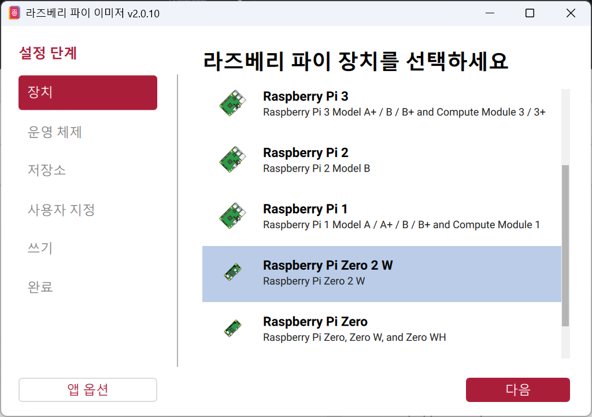
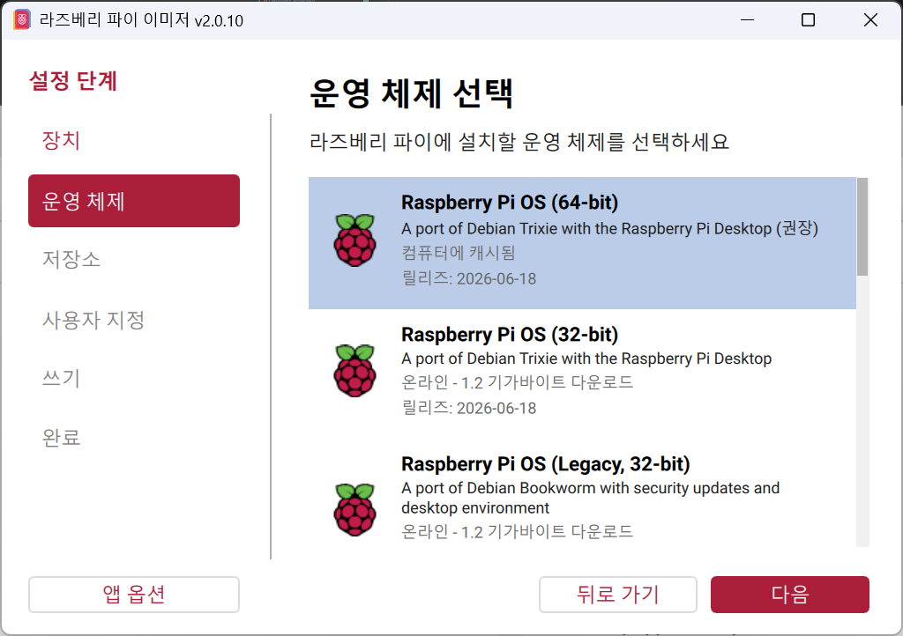
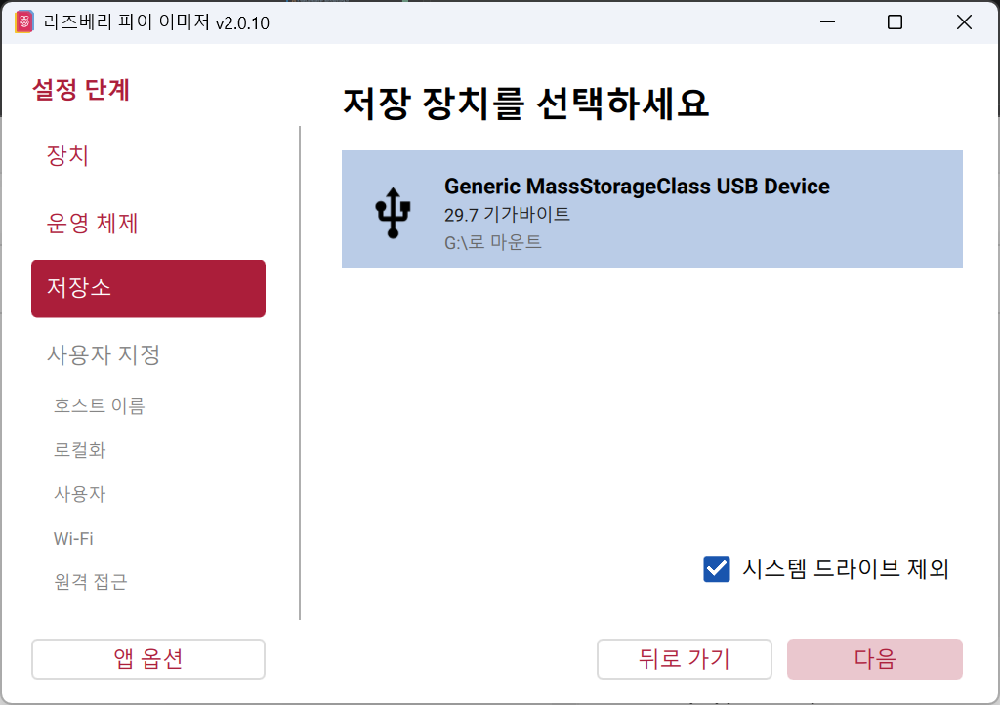
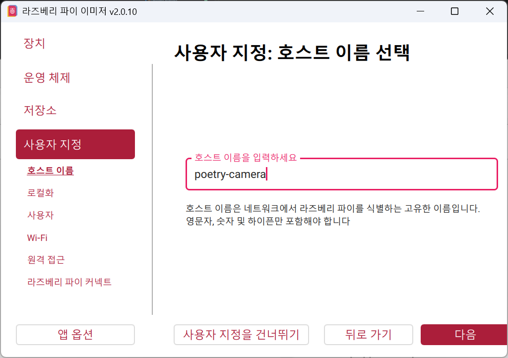
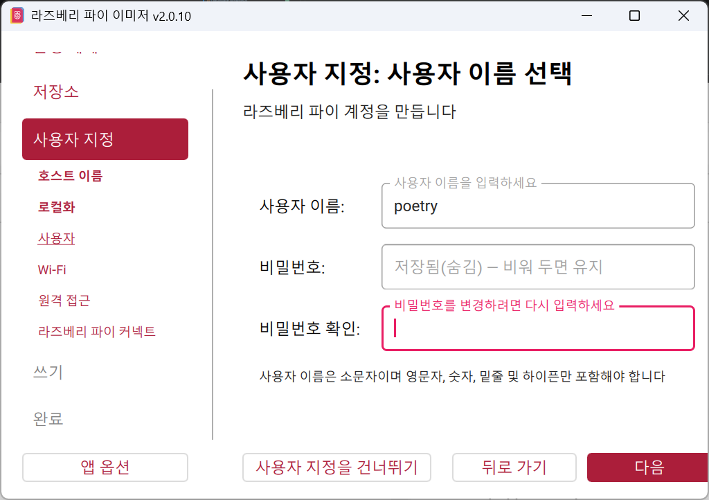
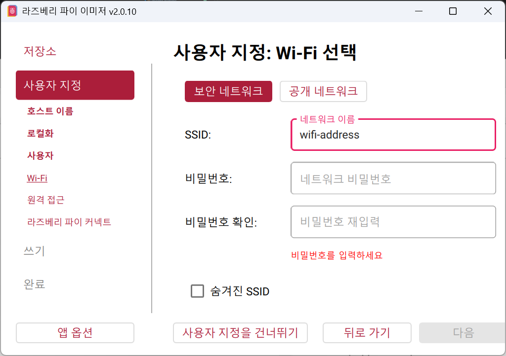
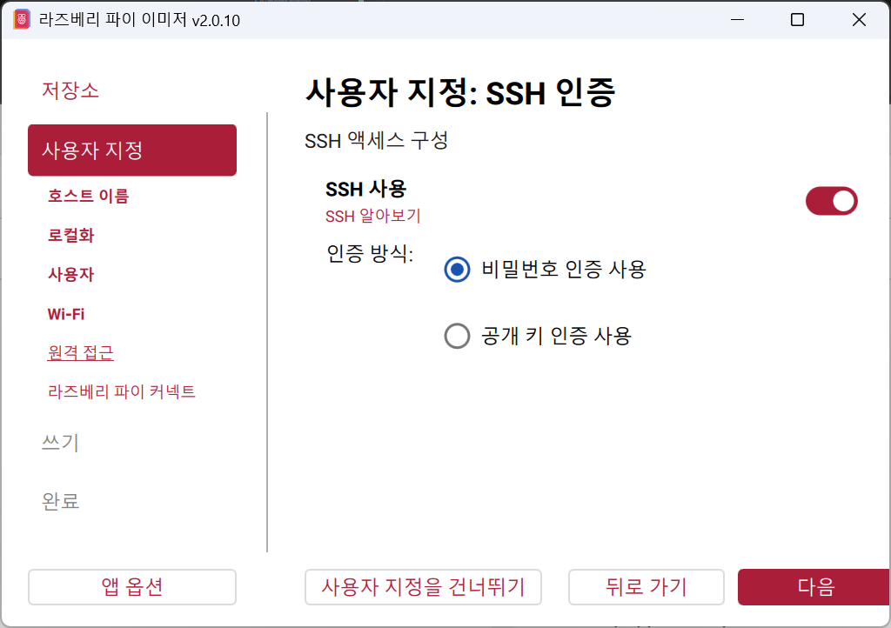
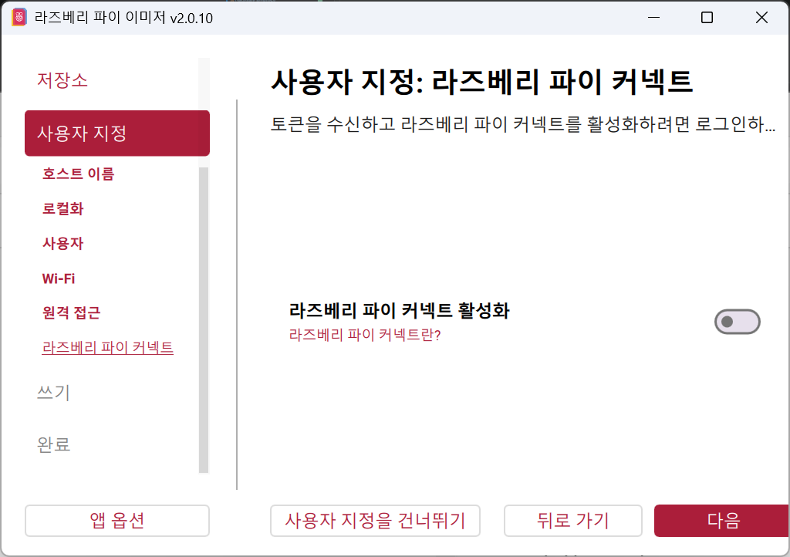
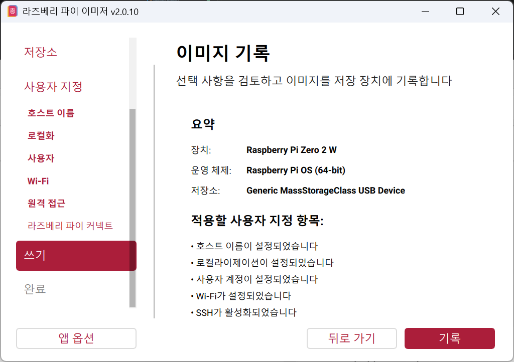
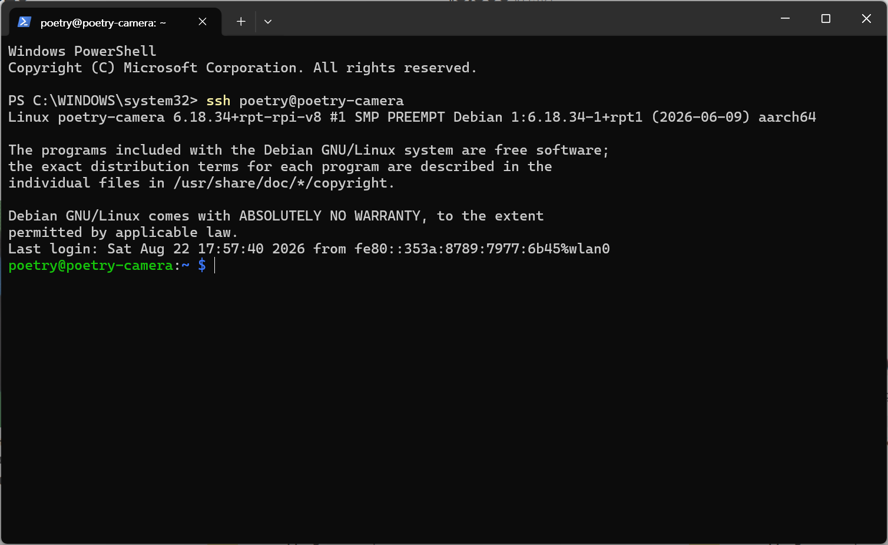

# 소프트웨어 설정

이 코드는 Google Gemini 모델로 사진을 한국어 시로 바꾸고,
감열 프린터로 인쇄합니다.

설치 순서는 다음과 같습니다. **API 키를 넣기 전에는 자동 실행을 켜지 마세요.**

1. OS 이미지 굽기와 SSH 접속
2. 라즈베리파이 인터페이스 설정
3. 패키지 설치
4. 배선
5. API 키 입력
6. 와이파이 등록
7. 수동 실행으로 동작 확인
8. 자동 실행 등록

## 파트 1. OS 이미지 굽기와 SSH 접속

<https://www.raspberrypi.com/software/> 에서 Raspberry Pi Imager 를 내려받아 설치합니다.


### 1단계. Raspberry Pi Imager 로 이미지 굽기

SD카드를 꽂고, Imager 에서 OS 를 골라 SD 카드에 굽습니다.









호스트 이름은 자유롭게 정합니다. SSH 접속에 쓰이므로 기억해 두세요.




사용자 ID 와 비밀번호를 설정합니다. 이것도 SSH 접속에 쓰이므로 기억해 두세요.



WiFi 이름과 비밀번호를 입력합니다.







### 2단계. 첫 부팅

굽기가 끝난 SD 카드를 라즈베리파이에 꽂고 전원을 넣으면 설정한 WiFi 에 자동으로 연결됩니다.

첫 부팅은 시간이 걸립니다. LED 가 빨강 점멸에서 초록으로 바뀔 때까지 약 1분 기다립니다.

### 3단계. SSH 로 접속

같은 WiFi 에 연결된 PC 에서 SSH 로 접속합니다.

윈도우에서는 `Win` 키를 누르고 `cmd` 를 입력하면 명령 프롬프트가 열립니다. 시작 메뉴의 Windows PowerShell 을 열어도 됩니다.

입력 형식은 다음과 같습니다.

```shell
ssh 사용자ID@호스트이름
```

호스트 이름 대신 IP 주소를 써도 됩니다.

```shell
ssh 사용자ID@IP주소
```

첫 접속에서는 fingerprint 를 신뢰할지 묻습니다. `yes` 를 입력합니다.

이어서 비밀번호를 입력하면 접속됩니다. **비밀번호는 입력해도 화면에 아무것도 표시되지 않습니다.**



접속에 성공하면 위와 같은 화면이 나옵니다.


## 파트 2. 라즈베리파이 설정

### 1단계. raspi-config 로 시리얼 켜기

```shell
sudo raspi-config
```

I6 Serial Port 
Login shell over serial  - No
Serial port hardware enable  - Yes

재부팅할지 물으면 `<No>` 를 고릅니다. 
2단계까지 마친 뒤 한 번에 재부팅합니다.


카메라는 별도 설정이 필요 없습니다. 최근 라즈베리파이 OS 는 `camera_auto_detect=1` 로 자동 인식합니다.

### 2단계. config.txt 를 직접 편집해 한 줄 추가

여기부터는 손으로 해야 합니다. **raspi-config 에는 이 항목의 메뉴가 아예 없습니다.** `/boot/firmware/config.txt` 맨 끝에 아래 한 줄을 넣습니다.

```ini
dtoverlay=disable-bt
```

nano 편집기로 파일을 엽니다. `sudo` 를 빠뜨리면 편집은 되지만 저장할 때 권한 오류가 납니다.

```shell
sudo nano /boot/firmware/config.txt
```

nano 편집은 키보드로 합니다. 
화면 아래쪽 안내줄에서 `^` 는 `Ctrl`, `M-` 는 `Alt` 를 뜻합니다.

| 키 | 동작 |
| --- | --- |
| `Alt` + `/` | 파일 맨 끝으로 이동 |
| `↑` `↓` `←` `→` | 커서 이동 |
| `Ctrl` + `O` → `Enter` | 저장 (파일명을 물으면 그대로 `Enter`) |
| `Ctrl` + `X` | 종료 |


1. 마지막 줄 끝에서 `Enter` 로 새 줄을 만들고 `dtoverlay=disable-bt` 를 입력합니다.
2. `Ctrl` + `O` 를 누르고 파일명이 그대로 뜨면 `Enter` — 아래에 `[ Wrote N lines ]` 가 나오면 저장된 것입니다.
3. `Ctrl` + `X` 로 빠져나옵니다.

기본 상태에서 `/dev/serial0` 은 mini UART(`ttyS0`)를 가리킵니다. mini UART 는 보레이트가 CPU 코어 클럭에 연동되어 클럭이 변할 때 글자가 깨지므로, 프린터처럼 계속 데이터를 보내는 장치에는 쓸 수 없습니다. 이 오버레이는 블루투스를 끄고 안정적인 PL011(`ttyAMA0`)을 GPIO14/15 에 연결합니다.

`sudo systemctl disable hciuart` 로 대체하려는 시도가 흔한데 **동작하지 않습니다.** 

그 명령은 블루투스 서비스만 끌 뿐이고, 핀 연결을 바꾸는 것은 디바이스 트리 작업이라 오버레이가 필요합니다.

### 3단계. 재부팅하고 확인

```shell
sudo reboot
```

재부팅 후 아래 두 명령으로 확인합니다.

```shell
grep -E "enable_uart|disable-bt" /boot/firmware/config.txt
ls -l /dev/serial0
groups
```

`enable_uart=1` 과 `dtoverlay=disable-bt` 가 **둘 다** 출력되어야 합니다. 그리고 `/dev/serial0` 이 `ttyAMA0` 를 가리키면 정상입니다. `groups` 결과에 `dialout` 이 있으면 sudo 없이도 프린터에 접근할 수 있습니다.


## 파트 3. 저장소와 패키지 설치

```shell
cd ~
git clone https://github.com/LeeMakeKR/poetry-camera-rpi.git
cd poetry-camera-rpi
pip3 install -r requirements.txt --break-system-packages
```

라즈베리파이 OS(Bookworm 이후)는 시스템 파이썬을 보호하므로 `--break-system-packages` 가 필요합니다.


### 폴더 구조

```text
python/          실행 코드 (main.py, thermal_raster.py, Adafruit_Thermal.py)
fonts/           한글 폰트 (nanum, nanum_handwriting)
images/          촬영본 보관. 파일명은 촬영 시각 (20260731_145213.jpg)
testcode/        하드웨어 검증 스크립트
```

`python/main.py` 는 자신의 상위 폴더를 저장소 루트로 보고 `fonts/` 와 `images/` 를 찾습니다. 폴더를 옮기면 이 관계가 유지되는지 확인하세요.

## 파트 4. 배선

핀 배치와 주의사항은 `hardware_setup.md` 에 정리되어 있습니다. 요약하면 다음과 같습니다.

| 부품 | 신호 | GPIO | 물리 핀 |
| --- | --- | --- | --- |
| 셔터 스위치 | 입력 | GPIO20 | 38 |
| WS2812 상태 LED | DATA IN | GPIO21 | 40 |
| 프린터 RX | Pi TX | GPIO14 | 8 |
| 프린터 TX | Pi RX | GPIO15 | 10 |

- 프린터 전원은 **반드시 별도 5V 2A 이상**을 쓰고 GND 만 파이와 공통으로 묶습니다.
- GPIO 는 3.3V 전용입니다. 5V 를 입력하면 핀이 손상됩니다.
- 케이블에 적힌 TX/RX 라벨이 실물과 반대인 경우가 있습니다. 인쇄가 안 되면 8번과 10번에 꽂은 두 선을 서로 바꿔 보세요.

배선 후 아래 순서로 확인하면 문제를 빨리 좁힐 수 있습니다.

```shell
python3 testcode/testUartLoopback.py    # 파이 UART 자체 점검
python3 testcode/testThermalPrint.py    # 프린터 텍스트 출력
python3 testcode/testCamera.py          # 카메라 촬영
sudo -E PYTHONPATH=/home/poetry/.local/lib/python3.13/site-packages \
  python3 testcode/testStatusLed.py     # 상태 LED 색 전환
```

## 파트 5. API 키 입력

**자동 실행을 켜기 전에 반드시 이 단계를 끝내세요.**

```shell
cd ~/poetry-camera-rpi
cp .env.example .env
nano .env
```

`.env` 에 발급받은 키를 한 줄로 넣습니다.

```text
GOOGLE_API_KEY=AIza로_시작하는_실제_키
```

```shell
chmod 600 .env
```

키 발급 방법과 `.gitignore` 동작은 `api_setup.md` 에 자세히 있습니다. `.env` 는 저장소에 올라가지 않습니다.

## 파트 6. 와이파이 등록

시 생성에는 인터넷이 필요합니다. 장소를 옮겨 다닌다면 갈 만한 곳의 와이파이를 미리 등록해 두세요.

```shell
cd ~/poetry-camera-rpi
cp wifi_networks.example.txt wifi_networks.txt
nano wifi_networks.txt
```

형식은 `이름,비밀번호,우선순위` 이고 우선순위 숫자가 클수록 먼저 시도합니다.

```text
내폰핫스팟,핫스팟비밀번호,20
집와이파이,비밀번호,10
작업실와이파이,비밀번호,5
```

등록:

```shell
sudo python3 python/wifi_apply.py
```

이 스크립트는 `nmcli` 로 NetworkManager 에 프로필을 만듭니다. 부팅할 때도 `poetry-camera.service` 가 자동으로 한 번 실행하므로, 파일만 고쳐 두면 다음 부팅부터 반영됩니다.

`wifi_networks.txt` 는 `.gitignore` 에 있어 저장소에 올라가지 않습니다.

### 처음 가는 장소에서 와이파이를 바꾸려면

**휴대폰 핫스팟을 가장 높은 우선순위로 등록해 두는 것이 핵심입니다.**

1. 휴대폰 핫스팟을 켭니다
2. 파이가 자동으로 붙습니다 (LED 가 빨강 점멸에서 초록으로 바뀜)
3. 같은 핫스팟에 노트북을 붙이고 SSH 로 접속합니다
4. `wifi_networks.txt` 에 그 장소의 와이파이를 추가하고 `sudo python3 python/wifi_apply.py` 를 실행합니다

파이를 AP 모드로 바꿔 웹페이지에서 설정하는 방식(comitup 등)도 있지만, 별도 데몬이 무선 장치를 계속 감시해야 해서 촬영 동작과 충돌할 여지가 있습니다. 핫스팟 방식이 더 단순하고 안정적입니다.

### SSH 로도 못 들어갈 때 (SD 카드로 복구)

핫스팟도 쓸 수 없어 파이에 접속할 방법이 아예 없는 상황을 위한 마지막 수단입니다. 파이 설정은 전혀 바꿀 필요가 없습니다.

1. 파이 전원을 끄고 SD 카드를 빼서 PC 에 꽂습니다
2. **`bootfs` 드라이브**가 보입니다. 이 파티션은 FAT32 라 윈도우에서 그대로 열립니다
3. 그 안에 `wifi_networks.txt` 를 만들고 접속할 와이파이를 적습니다

   ```text
   새로운와이파이,비밀번호,30
   ```

4. SD 카드를 파이에 다시 꽂고 켭니다

부팅할 때 `wifi_apply.py` 가 저장소 루트와 부팅 파티션 양쪽을 읽습니다. 같은 이름이 양쪽에 있으면 **부팅 파티션 쪽이 이깁니다.** 복구용으로 넣은 값이 옛 설정에 덮이지 않도록 하기 위해서입니다.

접속이 복구되면 이 파일은 지우세요. 부팅 파티션은 SD 카드를 꽂은 사람이면 누구나 읽을 수 있어 비밀번호가 그대로 노출됩니다.

```shell
sudo rm /boot/firmware/wifi_networks.txt
```

> USB 케이블로 PC 와 연결해 접속하는 방법(USB 가젯 모드)도 있지만, Pi Zero 2 W 는 데이터 포트가 하나뿐이라 그 포트의 USB 호스트 기능을 잃습니다. SD 카드 방식은 설정을 바꾸지 않아 그런 대가가 없습니다.

### 연결이 안 될 때

와이파이가 없으면 LED 가 **빨강 점멸**로 바뀌고 셔터 버튼을 눌러도 촬영하지 않습니다. 사진만 찍고 시를 못 만드는 상태를 피하기 위해서입니다.

부팅 직후에는 와이파이가 붙는 데 시간이 걸리므로 최대 60초를 기다립니다. 그 뒤에도 연결이 안 되면 빨강 점멸을 유지하고, 연결된 뒤 셔터 버튼을 누르면 다시 확인해 초록으로 돌아갑니다.

## 파트 7. 수동 실행으로 확인

자동 실행을 등록하기 전에 손으로 한 번 돌려 봅니다.

```shell
sudo -E PYTHONPATH=/home/poetry/.local/lib/python3.13/site-packages \
  python3 ~/poetry-camera-rpi/python/main.py
```

`main.py` 는 WS2812 때문에 **반드시 sudo** 로 실행해야 합니다. sudo 없이 실행하면 아무 메시지 없이 세그멘테이션 폴트로 죽습니다. `PYTHONPATH` 를 함께 넘기는 이유는 패키지가 `~/.local` 에 설치되어 root 환경에서 보이지 않기 때문입니다.

정상이라면 LED 가 다음 순서로 바뀝니다.

| 단계 | LED |
| --- | --- |
| 부팅/초기화 | 빨강 고정 |
| 촬영 대기 | 초록 고정 |
| 촬영·시 생성 | 초록 점멸 |
| **요청 한도 대기** | **노랑 점멸** |
| 인쇄 중 | 파랑 점멸 |
| 완료 | 초록 고정 |
| 오류 | 빨강 2초 후 초록 복귀 |
| **와이파이 없음** | **빨강 점멸** |

노랑 점멸은 Gemini 요청 한도(429)에 걸려 기다리는 중입니다. 5초, 15초, 45초 간격으로 3번까지 다시 시도한 뒤 초록 점멸로 돌아갑니다. 그동안 셔터 버튼은 받지 않습니다.

초록 고정 상태에서 셔터 버튼을 눌러 시가 인쇄되면 여기까지 성공입니다. 촬영본은 `images/` 에 촬영 시각 이름으로 쌓입니다.

### 왜 API 키를 먼저 넣어야 하나

자동 실행을 먼저 켜면 부팅할 때마다 키 없는 `main.py` 가 실행됩니다. 카메라와 프린터를 이미 점유한 상태라 손으로 테스트를 돌릴 수 없고, 매번 서비스를 멈춰 가며 작업해야 합니다.

이를 막기 위해 서비스 파일에 다음 줄을 넣어 두었습니다.

```ini
ExecStartPre=/usr/bin/test -s /home/poetry/poetry-camera-rpi/.env
```

`.env` 가 없거나 비어 있으면 서비스가 시작되지 않고 실패로 끝납니다. 그래도 순서를 지키는 편이 낫습니다.

## 파트 8. 부팅 시 자동 실행 등록

수동 실행이 확인된 뒤에만 진행하세요.

```shell
sudo cp ~/poetry-camera-rpi/poetry-camera.service /etc/systemd/system/
sudo systemctl daemon-reload
sudo systemctl enable poetry-camera.service
sudo systemctl start poetry-camera.service
```

상태와 로그 확인:

```shell
systemctl status poetry-camera.service
journalctl -u poetry-camera.service -f
```

재부팅해서 확인:

```shell
sudo reboot
```

부팅 후 LED 가 빨강에서 초록으로 바뀌면 정상입니다.

### 자동 실행 끄기

코드를 고치거나 테스트 스크립트를 돌릴 때는 서비스를 멈춰야 카메라와 프린터가 풀립니다.

```shell
sudo systemctl stop poetry-camera.service     # 지금만 멈춤
sudo systemctl disable poetry-camera.service  # 다음 부팅부터 안 뜸
```

다시 켤 때는 `enable` 과 `start` 를 다시 실행합니다.

### 코드를 고친 뒤

```shell
sudo systemctl restart poetry-camera.service
```

## 문제 해결

| 증상 | 원인과 조치 |
| --- | --- |
| 아무 메시지 없이 죽음 (종료 코드 139) | sudo 를 빠뜨렸습니다. WS2812 가 권한 없이 죽습니다 |
| `GOOGLE_API_KEY 를 찾지 못했습니다` | 파트 5 를 다시 하세요. 메시지 아래에 파일 경로가 함께 나옵니다 |
| 인쇄가 전혀 안 됨 | 프린터 전원만 껐다 켜서 설정 페이지가 나오는지 확인 → 나오면 배선(TX/RX, GND) 문제 |
| 인쇄물이 알 수 없는 문자로 도배됨 | 이미지 명령 호환 문제입니다. 프린터 전원을 끄세요. 이 문서의 "이미지 출력" 참고 |
| 서비스가 계속 재시작됨 | `journalctl -u poetry-camera.service` 로 원인 확인. `.env` 누락이면 `ExecStartPre` 에서 멈춥니다 |
| 카메라를 못 엶 | 서비스가 이미 점유 중일 수 있습니다. `sudo systemctl stop poetry-camera.service` 후 재시도 |
| LED 가 빨강으로 계속 점멸 | 와이파이 미연결입니다. 휴대폰 핫스팟을 켜거나 `nmcli device wifi list` 로 신호를 확인하세요 |
| LED 가 노랑으로 점멸 | Gemini 요청 한도(429)입니다. 그대로 두면 알아서 다시 시도합니다 |
| `일일 요청 한도를 다 썼습니다` | 오늘은 기다려도 안 풀립니다. <https://aistudio.google.com/apikey> 에서 한도를 확인하세요 |
| 와이파이를 등록했는데 안 붙음 | `sudo python3 python/wifi_apply.py` 를 실행했는지, 이름과 비밀번호 앞뒤에 공백이 없는지 확인하세요 |
| SSH 로 접속조차 안 됨 | SD 카드를 PC 에 꽂아 `bootfs` 드라이브에 `wifi_networks.txt` 를 넣고 재부팅하세요 |

## 프린터 사양 (실측)

프린터에 전원을 넣으면 자체 설정을 인쇄합니다. 검증된 기기의 값입니다.

| 항목 | 값 |
| --- | --- |
| 보레이트 | 9600 고정 (19200 이상은 전부 깨짐) |
| 코드 방식 | codepage |
| 문자 타입 | U24 |
| 언어 | PC936 (중국어 GBK) |
| 한 줄 폭 | 32칸 |
| heattime | 255 (80/120/180/255 비교 후 선택) |

한 줄 폭 32칸은 `main.py` 의 `wrap_text(poem, 32)` 설정과 일치하므로 코드 수정이 필요 없습니다.

heattime 은 라이브러리 기본값이 120 이지만 이 기기에서는 255 가 가장 선명했습니다. `main.py` 에서 프린터 생성 직후 `printer.writeBytes(27, 55, 11, 255, 40)` 으로 지정합니다. 생성자에 `heattime=` 인자를 넘기면 pyserial 3.5 에서 `TypeError` 가 납니다.

heattime 255 는 발열 시간이 길어 인쇄가 느리고 순간 전류가 큽니다. 프린터 전원이 2A 이상이어야 합니다.

언어가 PC936 이라 **한글은 인쇄되지 않습니다.** 그래서 이 프로젝트는 시를 이미지로 렌더링해 출력합니다.

## 이미지 출력 (중요)

### `printImage()` 를 쓰면 안 됩니다

`Adafruit_Thermal.printImage()` 는 **DC2 `*` (18, 42)** 비트맵 명령을 씁니다. 이 프린터는 이 명령을 인식하지 못하고 뒤따르는 이미지 데이터 전체를 **문자로 해석해 인쇄**합니다. 384x288 이미지 3장을 시도했을 때 약 4만 바이트가 알 수 없는 문자로 쏟아져 나왔습니다.

**멈추는 방법은 프린터 전원을 끄는 것뿐입니다.** 파이에서 프로세스를 죽여도 이미 프린터 버퍼로 넘어간 데이터는 계속 인쇄됩니다.

PC936 계열은 DC2 `*` 대신 **`GS v 0` (29, 118, 48)** 라스터 명령을 씁니다. 이 기기에서 정상 동작을 확인했습니다.

### `GS v 0` 사용법

```text
29 118 48 m xL xH yL yH  +  비트맵 데이터
  m  = 0 (일반 모드)
  xL, xH = 가로 바이트 수 (384도트 = 48바이트)
  yL, yH = 세로 도트 수
```

데이터는 1비트가 검정입니다. 가로는 **384도트 고정**이며 초과분은 축소가 아니라 잘려 나가므로, 보내기 전에 반드시 384픽셀 폭으로 리사이즈해야 합니다.

**새 프린터를 붙일 때는 항상 `testcode/testRasterProbe.py` 를 먼저 돌리세요.** 384x32 (종이 약 5cm) 만 인쇄하므로 호환되지 않는 프린터에서 시도해도 피해가 작습니다.

### 인쇄 속도

보레이트가 9600 고정이라 **보내는 도트 수가 곧 인쇄 시간**입니다. 한 행 48바이트에 55ms 가 걸립니다.

프린터 자체는 그보다 빨라 항상 전송이 병목입니다. 따라서 전송 시간과 인쇄 시간을 **더해서 기다리면 안 됩니다.** `thermal_raster.print_raster()` 는 둘 중 큰 값만 기다립니다.

빈 여백도 그대로 전송되므로 여백을 줄이는 것이 곧 속도 개선입니다. `main.py` 는 줄마다 이미지를 만들지 않고 연 단위로 묶어 한 번에 보냅니다.

측정값 (8줄 시 + 헤더 + 푸터, 폰트 48):

| 방식 | 전송 행수 | 소요 |
| --- | --- | --- |
| 줄 단위 + 대기 중복 | 990 | 84초 |
| 연 단위 + 대기 개선 | 666 | 37초 |

폰트를 48 에서 36 으로 내리면 약 25% 더 빨라지지만 글자가 작아집니다.

흑백 변환은 **오차확산 디더링(1 DITHER)** 이 실물에서 가장 보기 좋아 기본값입니다.

### `writeBytes()` 로 대량 데이터를 보내면 안 됩니다

`Adafruit_Thermal.writeBytes()` 는 인자 N개를 받으면 **바이트마다 N배씩** 대기해 총 대기 시간이 N² 에 비례합니다. 48바이트 한 행에 2.6초, 32행이면 85초입니다.

이미지처럼 큰 데이터는 부모 클래스의 `Serial.write()` 로 한 번에 보내고 대기 시간을 직접 계산합니다.

```python
from serial import Serial

printer.timeoutWait()
Serial.write(printer, payload)
Serial.flush(printer)
time.sleep(len(payload) * 11.0 / baud + height * printer.dotPrintTime)
```

### 알려진 라이브러리 버그

| 위치 | 문제 | 우회 방법 |
| --- | --- | --- |
| `printImage()` | DC2 `*` 명령이 이 프린터에서 미지원 | `GS v 0` 로 직접 전송 |
| `writeBytes()` | 대기 시간이 N² 에 비례 | `Serial.write()` 직접 호출 |
| `__init__()` | `firmware` / `heattime` kwargs 를 pyserial 로 넘겨 3.5 에서 `TypeError` | 생성 후 `writeBytes(27, 55, 11, heattime, 40)` |

## 테스트 스크립트

서비스를 멈춘 뒤(`sudo systemctl stop poetry-camera.service`) `testcode/` 아래에서 실행합니다.

| 스크립트 | 용도 |
| --- | --- |
| `testUartLoopback.py` | 파이 UART 자체 점검. 핀 8과 10을 점퍼선으로 직결 후 실행 |
| `testRasterProbe.py` | 새 프린터 호환성 확인. **가장 먼저 돌릴 것** |
| `testThermalPrint.py` | 기본 출력 확인 |
| `testThermal.py` | 보레이트 / 농도 / 스타일 전체 진단 |
| `testKoreanPrint.py` | API 키 없이 한글 시 인쇄 경로만 확인 |
| `testCamera.py`, `testCameraPrint.py` | 촬영 및 사진 인쇄 |

`main.py` 를 임포트하는 스크립트(`testKoreanPrint.py`, `testStatusLed.py`)는 sudo 가 필요합니다.


## 폰트

네이버 나눔글꼴 <https://hangeul.naver.com/font> 을 사용합니다. `fonts/` 아래 모든 `.ttf` / `.otf` 를 재귀적으로 찾아 실행할 때마다 하나를 무작위로 고릅니다.


